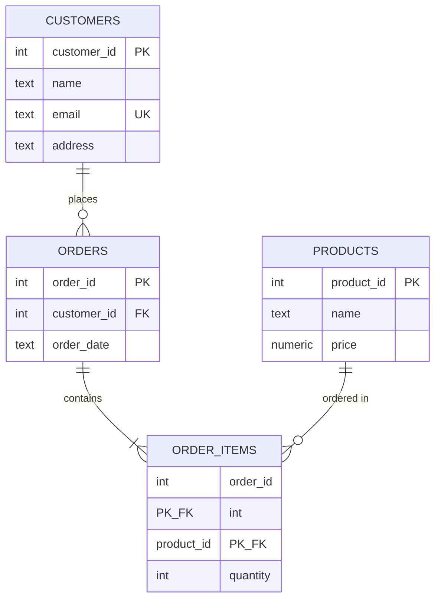

# DB設計ガイド: 正規化を実例で学ぶ

[重要] 本書は「テーブルをどう分けるか」（正規化）を、EC（通販）の注文管理という
具体的な題材を通して、悪い例→段階的な改善→良い例の順に学ぶための補助資料です。
対応する実行可能コードは [`normalization_example.py`](normalization_example.py) を参照してください
（本書で説明する「異常(anomaly)」を実際にSQLiteで再現し、良い設計ではそれが起きないことを確認できます）。

[相互参照] 列単位の設計（型・制約・インデックス）は [`schema_design_good_vs_bad.py`](schema_design_good_vs_bad.py)、
本書はテーブル単位の設計（何を1つのテーブルにまとめ、何を分けるか）を扱います。

---

## 1. 悪い例: 1枚の巨大テーブルにすべて詰め込む

「注文」を記録するシステムを考えます。初心者がまず書きがちなのが、次のような
「1行に全部入り」のテーブルです。

```sql
CREATE TABLE orders_flat (
    order_id        INTEGER,
    customer_name   TEXT,
    customer_email  TEXT,
    customer_address TEXT,
    product_name    TEXT,
    product_price   NUMERIC,
    quantity        INTEGER,
    order_date      TEXT
);
```

一見動きそうに見えますが、これには3種類の「異常(anomaly)」と呼ばれる問題が潜んでいます。

### 1-1. 更新時異常（update anomaly）

同じ顧客が複数回注文すると、`customer_name`/`customer_email`/`customer_address`が
**注文の数だけ重複して**保存されます。顧客が引っ越して住所が変わったとき、
その顧客の**全注文行**を漏れなく更新しないと、同じ顧客なのに行によって住所が
違うという矛盾したデータになります（1行だけ更新し忘れる、というミスが起きやすい）。

### 1-2. 挿入時異常（insertion anomaly）

「新しい商品をカタログに追加したいが、まだ誰も注文していない」という場合、
`product_name`/`product_price`を保存する場所が無い（このテーブルは「注文」が
無いと行自体を作れない）。同様に「新規顧客を登録したいが、まだ何も注文していない」
場合も同じ問題が起きます。

### 1-3. 削除時異常（deletion anomaly）

ある顧客の**唯一の注文**をキャンセル（削除）すると、その顧客の連絡先情報を
記録していた行ごと消えてしまい、顧客情報そのものが失われます。

### 1-4. 繰り返しグループの問題（第1正規形違反）

1つの注文で複数の商品を買った場合、この設計では「1商品につき1行」を作るしかなく、
`order_id`が重複する行が並びます（`order_id`だけでは1行を一意に特定できない）。
あるいは`product_name_1`, `product_price_1`, `product_name_2`, `product_price_2`...と
列を横に増やす設計にする人もいますが、これは「注文できる商品数の上限」を
テーブル構造に決め打ちしてしまう、さらに悪い設計です。

---

## 2. 正規化のステップ

「正規化」とは、上記のような異常が起きないように、テーブルを段階的に分割していく
設計手法です。代表的な3段階（第1正規形〜第3正規形）を、この題材で追っていきます。

### 第1正規形（1NF）: 繰り返しグループを排除する

「1つのセルには1つの値だけを入れる」「1行に商品を何個でも横に並べる、をやめる」。
1注文1商品の行に分解します（この時点ではまだ顧客情報が商品ごとに重複している）。

```
orders_1nf(order_id, customer_name, customer_email, customer_address, product_name, product_price, quantity, order_date)
```
※`order_id`が同じ行が複数存在しうる（商品の数だけ）。

### 第2正規形（2NF）: 部分関数従属を排除する

このテーブルの主キーは実質「(order_id, product_name)」の組み合わせです。しかし
`customer_name`等は`product_name`に関係なく`order_id`だけで決まります（＝主キーの
一部にしか従属していない＝部分関数従属）。これを別テーブルに切り出します。

```
orders(order_id, customer_name, customer_email, customer_address, order_date)
order_items(order_id, product_name, product_price, quantity)
```

これで挿入時異常（注文が無いと顧客を登録できない問題）と更新時異常（商品行ごとに
顧客情報が重複する問題）の一部は解消しますが、まだ`orders`テーブルの中で
`customer_email`/`customer_address`が`customer_name`に依存している問題が残っています
（同じ顧客が複数回注文すれば、やはり顧客情報が`orders`テーブル内で重複します）。

### 第3正規形（3NF）: 推移的関数従属を排除する

`orders`テーブルの中で、`customer_email`/`customer_address`は主キー`order_id`にではなく、
非キー列である`customer_name`に依存しています（`order_id`→`customer_name`→`customer_email`
という「間接的な」依存＝推移的関数従属）。顧客情報を独立したテーブルに切り出します。

```
customers(customer_id PK, name, email, address)
products(product_id PK, name, price)
orders(order_id PK, customer_id FK, order_date)
order_items(order_id FK, product_id FK, quantity)
```

これで3つの異常すべてが解消されます（詳細と実測は`normalization_example.py`参照）。
- 更新時異常なし: 顧客の住所は`customers`に1箇所だけ存在する
- 挿入時異常なし: 注文が無くても顧客・商品を独立して登録できる
- 削除時異常なし: 注文を削除しても顧客・商品の情報は消えない

### 最終形のER図



[注意] Mermaid記法はGitHub/多くのMarkdownビューアで自動的に図として描画されますが、
描画されない環境向けに、同じ内容を表形式でも示します（`PK`=主キー, `FK`=外部キー,
`UK`=一意制約, `PK,FK`=複合主キーの一部かつ外部キー）。

| テーブル | 列 | 型 | キー | 説明 |
|---|---|---|---|---|
| `customers` | `customer_id` | INTEGER | PK | サロゲートキー（自動採番） |
| | `name` | TEXT | | 氏名 |
| | `email` | TEXT | UK | 一意制約（ナチュラルキー候補、詳細は次章） |
| | `address` | TEXT | | 住所 |
| `products` | `product_id` | INTEGER | PK | サロゲートキー |
| | `name` | TEXT | | 商品名 |
| | `price` | NUMERIC | | 単価 |
| `orders` | `order_id` | INTEGER | PK | サロゲートキー |
| | `customer_id` | INTEGER | FK → customers | どの顧客の注文か |
| | `order_date` | TEXT | | 注文日時 |
| `order_items` | `order_id` | INTEGER | PK(複合), FK → orders | 中間テーブル（下記参照） |
| | `product_id` | INTEGER | PK(複合), FK → products | 中間テーブル |
| | `quantity` | INTEGER | | 個数 |

関係の読み方（ER図の記号）: `CUSTOMERS ||--o{ ORDERS`は「1人の顧客(||)は0件以上の注文(o{)を持つ」、
`ORDERS ||--|{ ORDER_ITEMS`は「1件の注文(||)は1件以上の注文明細(|{)を持つ」という意味。

---

## 3. キーの選び方（主キー・外部キー・複合キー）

「どう分けるか」（テーブル分割）と同じくらい重要なのが「キーをどう選ぶか」です。

### 3-1. 主キー: サロゲートキー vs ナチュラルキー

- **サロゲートキー(surrogate key)**: システムが自動採番する、業務的な意味を持たない値
  （例: `customer_id INTEGER PRIMARY KEY`）。上記のER図では全テーブルがこの方式。
  - 利点: 値が変わらない（顧客が改姓してもIDは不変）、他テーブルからの参照が軽量（整数1つ）。
  - このリポジトリでの実例: 各テーブルの`*_id`列、Djangoの`id`（`BigAutoField`、
    `python/examples/django_minimal/books/models.py`参照）。
- **ナチュラルキー(natural key)**: 業務データそのものを主キーにする（例: `email`を主キーにする）。
  - リスク: 値が変わりうる（メールアドレス変更等）→変更のたびに参照元をすべて追従させる必要が生じる。
    「メールは一意」という業務前提が将来崩れる可能性もある（例: 家族で1つのメールを共有したい等）。
- **[推奨]** 基本はサロゲートキー（自動採番の整数またはUUID）を主キーにし、
  ナチュラルキーには別途`UNIQUE`制約を付ける（上表の`email UK`）。両方の利点を得られる。

### 3-2. 外部キー: `ON DELETE`の挙動を明示的に選ぶ

子テーブルが親テーブルを参照している状態で、親の行が削除されたときの挙動を選べます。

| 指定 | 挙動 | この題材での例 |
|---|---|---|
| `ON DELETE CASCADE` | 親を消したら子も自動的に消す | 注文(`orders`)を消したら、その注文明細(`order_items`)も消える |
| `ON DELETE RESTRICT`（既定に近い） | 子が存在する限り、親の削除を拒否する | 注文履歴がある顧客は、`customers`から消せなくする |
| `ON DELETE SET NULL` | 親を消したら、子の外部キー列をNULLにする | 担当者(社員)が退職しても、過去の注文記録は残し「担当者未設定」にする |

[重要] これを決めずに「とりあえずCASCADE」にすると、意図せず大量の関連データが
連鎖削除される事故につながる。逆に何でも`RESTRICT`にすると、正当な削除操作まで
毎回手動でブロックを解除する手間が発生する。「このテーブルを消したとき、
子テーブルはどうあるべきか」を都度考えて選ぶ。

### 3-3. 複合キー: 中間テーブルの主キー

`order_items`のように、2つの外部キーの**組み合わせ自体**が「その関係が存在すること」を
表す場合、`PRIMARY KEY (order_id, product_id)`という複合主キーにする。

```sql
CREATE TABLE order_items (
    order_id   INTEGER NOT NULL REFERENCES orders(order_id),
    product_id INTEGER NOT NULL REFERENCES products(product_id),
    quantity   INTEGER NOT NULL CHECK (quantity > 0),
    PRIMARY KEY (order_id, product_id)
);
```

こうすることで「同じ注文に同じ商品を重複登録できない」という業務ルールを、
アプリケーションコードではなくDB自身に守らせられる（複合主キー自体が一意制約でもあるため）。

---

## 4. 多対多(M:N)関係と中間テーブル

「1つの注文は複数の商品を含む」し「1つの商品は複数の注文で買われる」ため、
`orders`と`products`は**多対多**の関係です。RDBでは多対多を直接表現できないため、
両方への外部キーを持つ「中間テーブル（ジャンクションテーブル/関連テーブル）」を挟みます。

```
order_items(
    order_id   INTEGER REFERENCES orders(order_id),
    product_id INTEGER REFERENCES products(product_id),
    quantity   INTEGER NOT NULL CHECK (quantity > 0),
    PRIMARY KEY (order_id, product_id)
)
```

`order_items`が「注文Xに商品Yが何個含まれるか」という**関係そのもの**を1行として表す。
これは`python/examples/django_minimal/`の`Book`→`Author`（1対多）よりも一段階複雑な
「多対多」の例であり、Djangoなら`ManyToManyField`（内部的にはやはり中間テーブルを生成する）
に相当します。

---

## 5. いつ非正規化してよいか

正規化は「データの整合性」を保証する一方、検索時に複数テーブルをJOINする必要が増え、
読み取り性能とのトレードオフになります。以下のようなケースでは、意図的に
正規形を崩す（非正規化する）ことが実務では珍しくありません。

- **集計値のキャッシュ**: `orders`テーブルに`total_amount`（合計金額）列を持たせ、
  `order_items`を毎回合計しなくても済むようにする。ただし`order_items`が変わったら
  `total_amount`も更新する処理を必ずセットで用意しないと、値がズレる（不整合の温床になる
  ため、更新をどこか1箇所の関数/トリガーに集約するなど、更新経路を絞る設計が必須）。
- **分析/レポート用の別スキーマ（OLAP）**: 日々のトランザクション処理（OLTP）は正規化した
  スキーマで整合性を保ちつつ、集計・分析用には非正規化した「スタースキーマ」等の
  別テーブル群を定期的に作り直す、という役割分担がよく使われる。
- **読み取りが極端に多く、書き込みがほぼ無いデータ**: JOIN のコストが実測でボトルネックと
  分かった場合に限り、検討する（「なんとなく速そうだから」で最初から非正規化しない。
  `EXPLAIN`で実際にJOINが問題かを確認してから判断するのが本来の順序）。

[重要] 非正規化は「整合性を保つコスト」を引き受ける代わりに読み取り性能を得るトレードオフ。
まず正規化された設計を基本形とし、実測に基づいて必要な箇所だけ非正規化するのが定石。

---

## 6. まとめ表

| 段階 | 排除する問題 | 判断基準 |
|---|---|---|
| 第1正規形(1NF) | 繰り返しグループ、複数値を持つセル | 1つのセルに1つの値だけが入っているか |
| 第2正規形(2NF) | 部分関数従属 | 複合主キーの一部だけに従属する列がないか |
| 第3正規形(3NF) | 推移的関数従属 | 非キー列が別の非キー列に依存していないか |
| 非正規化（意図的） | （正規化の逆。性能とのトレードオフ） | 実測でJOINがボトルネックと確認できたか |

## 変更履歴

- 2026-08-03: 新規作成。EC注文管理を題材に、正規化のステップと非正規化の判断基準を整理。
